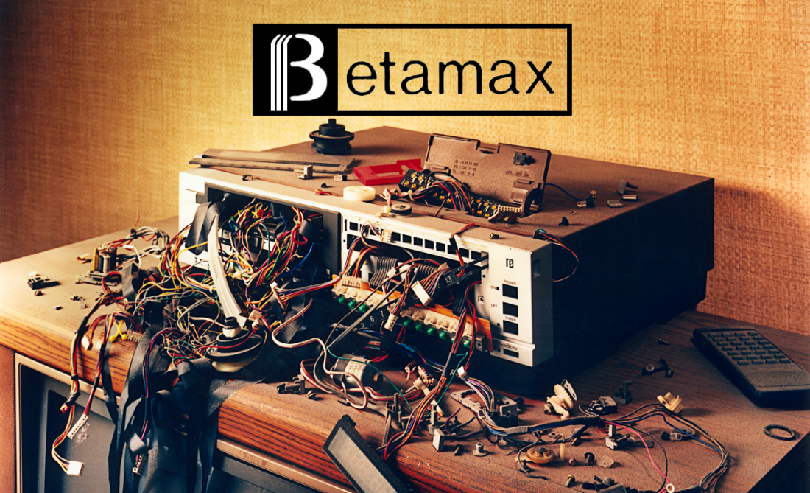

# IASC 2P02 | Khalid Imam

## Bio.

I'm currnetly a second year student at Brock University majoring in Interactive Arts & Science.
My specific research area of interest is the digital expression field associated with foundations towards media and art curation, which I wish to specialize in "the gap in between what I have learned from the digital aspect of humanities with the visual components from art electives". In the blend of this concentration, I'd say media transformations alongside the issues that revolve in the digital humanities are two of the very few areas that really captivate me and allow honest and flexible contribution. In my free time outside lectures, I enjoy taking pictures, editing videos, producing music, and watching movies. These culterd elements of design and media really help develop a better sense of where I aim on taking things in the future. Every now and then, I grasp whatever material that was taught from the courses I'm enrolled in and apply them to ideas and concepts that already intrigue me. Essentially, Multimedia Design is where I see potential as a career choice given what I already know about digital curation of content and how technology aligns with the way we interact with it. The work displayed below are prominent examples of the highlight in which my specialization is involved. 

## Featured Project: BETAMAX

BETAMAX was the very first video-casette recording technology (VCR) that was produced by Sony in 1975. 
With the capability of being able to control the flow of TV time, this pioneer device allowed for users to record up to an hour of audio-video footage from their own homes. This was a significant feature that wasn't seen till the modern DVRs of the early 2000s. Now, shortly after Sony's successful release had come a brand new technological advancement from the company JVC, which was the VHS (Video Home System). As opposed to the VCR, VHS offered a much wider capacity for recording and playback capabilities and required less wear to fully function/maintain use. From this point on, the home video recording and reproduction market was more or less in their grip.
The late 80s saw competitve means between the two platofroms and resulted in a format wars. In the midst of legality allegations, VCR consumption saw a downfall but formed a new sense of relevance in the market with its 'home-video recording technology' which made a case in court. The case adresses the allegations which Universal Studios declared towards Sony Corporation of America involving copyright infringement by allowing users to record TV content from their own homes. The following action was concluded as fair use because it doesn't constitue in any forms against law, the only it would do so is if people made copies of the content they were recording (pirating), a very common scheme used today which is considered illegal. I do strongly believe that the early influence of such act does stem to this technology that VCR had introduced, but its very low-profile. Its evident how much of an impact its operative use and interactiona technolgy has had on a lot of the more recent devices that we use today such as: Blu-Ray DVR players, Sony-Slim HD systems, Panaasonic, Toshiba and even built-in Windows Media Players. 

Here is my 250 word statement describing how this research evolved over time. I made thse changes, which you can see [here] 

I also made these changes, which you can see [here]

I also made these changes, which you can see [here]
Overall these changes show x and y changes in my thinking. 

Read [Title goes here](readme)

## Colaborative Project [Title of project here]

Here is my 100-word project description.

Here is my 250-word collaboration statement. I approach collaboration in x ways, which is reflected in y work (available [here]
I also approach collaboration in ways, which is reflected in b work (available [here]
I also contributed x assetes to my team, seen below.

# Research Presentation [Title of project here]

Drucker blog post : [click here to learn more about a Humanities Approach to Graphical Display](publishblogpost.md) 

## Academic blog [Title of project here]

[click here](https://iascatbrock.github.io/IASC-2P02/reveal/index.html)
